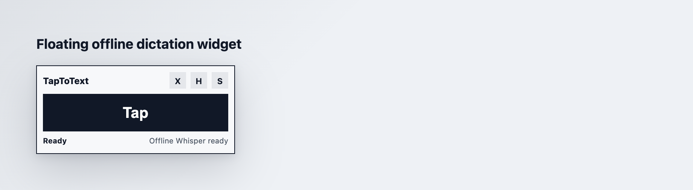
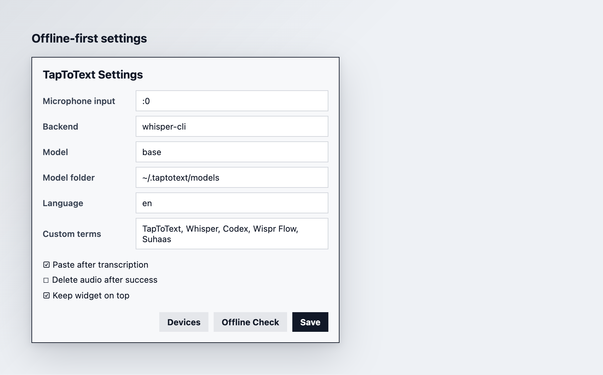
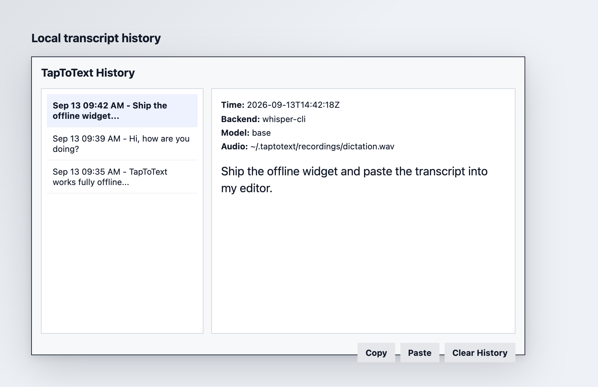

# TapToText

TapToText is a local-first macOS dictation helper with a Wispr Flow-style
workflow: trigger recording, speak, stop recording, then copy or paste the
transcript into the active app.

It records through `ffmpeg`, transcribes through a local `whisper` CLI by
default, stores transcript history locally, and uses macOS clipboard tools for
delivery. The OpenAI backend still exists as an optional fallback, but the main
project does not require APIs or billing.

## Screenshots

### Floating Widget



### Offline Settings



### Transcript History



## Setup

From this folder:

```bash
cd /Users/suhaasn/ST/TapToText
python3 -m venv .venv
. .venv/bin/activate
```

Install the lightweight UI/hotkey dependencies:

```bash
python -m pip install -r requirements.txt
```

## Install Offline Transcription

Install local Whisper support:

```bash
./install_offline_whisper.sh
```

Then verify:

```bash
python taptotext.py --check-offline
```

The first transcription may download the selected local Whisper model. Use
`base` first because it is a practical balance of speed and quality. The
installer preloads `base` into `~/.taptotext/models`.

## Find Your Microphone

List macOS `avfoundation` devices:

```bash
python taptotext.py --list-devices
```

Audio devices are listed after the video devices. The default input is `:0`,
meaning the first audio input. If your microphone is listed as audio device 1,
use `--input-device ":1"`.

macOS may ask for Microphone permission for Terminal, Python, or `ffmpeg`.
If the output only shows `Input/output error` and no audio device names, check
macOS Microphone permission for the terminal app you are using.

## Run Once

This mode is easiest to test:

```bash
python taptotext.py --once --input-device ":0"
```

It copies the transcript to the clipboard. To paste automatically after
transcription:

```bash
python taptotext.py --once --paste --input-device ":0"
```

Automatic paste uses AppleScript and may require Accessibility permission for
Terminal or your Python process.

## Floating Widget

You can run TapToText as a compact floating desktop widget:

```bash
open /Users/suhaasn/ST/TapToText/TapToText.app
```

The widget does not show a normal Dock app window. It appears as a small
always-on-top panel that you can drag by its top bar. Use `S` for settings, `H`
for history, and `X` to quit.

Click `Tap` once to start recording and click `Stop` to finish. After
transcription, the text is copied or pasted based on the saved settings.

Recommended widget workflow:

```text
1. Click in your editor where the text should go.
2. Click Tap in TapToText.
3. Speak.
4. Click Stop.
5. TapToText hides briefly and pastes back into your editor.
```

Open `Settings` in the widget to set:

- Microphone input, such as `:0`
- Backend and model
- Local model folder
- Custom terms, such as names, product names, and technical terms
- Paste behavior
- Always-on-top behavior
- OpenAI API key, only if you intentionally choose the OpenAI backend

Use these offline settings:

```text
Backend: whisper-cli
Model: base
Model folder: ~/.taptotext/models
```

The widget stores non-secret settings in `~/.taptotext/config.json` and local
transcript history in `~/.taptotext/history.jsonl`. If you choose the optional
OpenAI backend, the API key is stored in macOS Keychain under
`com.taptotext.openai`.

The app launcher writes logs to:

```bash
~/.taptotext/widget.log
```

## Global Hotkey Mode

Install `pynput` first, then run:

```bash
python taptotext.py --daemon --paste --input-device ":0"
```

Default hotkey:

```text
Command + Shift + Space
```

Press it once to start recording and again to stop. The transcript is copied and
pasted into whichever app has focus.

You can change the hotkey:

```bash
python taptotext.py --daemon --paste --hotkey '<ctrl>+<alt>+space'
```

## Backend Options

Local Whisper backend, default:

```bash
python taptotext.py --once --backend whisper-cli --model base
```

The local backend expects a `whisper` command on `PATH`, such as the CLI from
`openai-whisper`.

OpenAI backend, optional:

```bash
python taptotext.py --once --backend openai --model gpt-4o-mini-transcribe
```

Higher quality OpenAI option:

```bash
python taptotext.py --once --backend openai --model gpt-transcribe
```

## Useful Flags

```bash
--language en
--prompt "Names: Suhaas, ShopOS, Genpact. Use concise punctuation."
--custom-terms "Suhaas, ShopOS, Genpact"
--delete-audio
--output-dir ~/.taptotext/recordings
```

## Resume Angle

TapToText is designed to be presented as a local-first productivity tool:

```text
Built a local-first macOS dictation app with offline speech recognition,
floating widget UI, clipboard automation, configurable microphone settings,
custom vocabulary biasing, and privacy-preserving transcript history.
```

## Troubleshooting

If recording fails, run `--list-devices` and choose the correct `--input-device`.

If paste fails, give Accessibility permission to the terminal app you are using
under macOS System Settings.

If the widget says the transcript was copied but nothing appears in your editor,
macOS is blocking automatic paste. Open **System Settings > Privacy & Security >
Accessibility** and allow `TapToText`. Until that is enabled, click in your
editor and press `Command+V`; TapToText still copies the transcript to the
clipboard.

If offline transcription says `whisper` is missing, run
`./install_offline_whisper.sh` from the project folder.

If the optional OpenAI backend fails with `OPENAI_API_KEY`, check that the
environment variable is set in the same shell where you run TapToText or save
the key in widget Settings.
